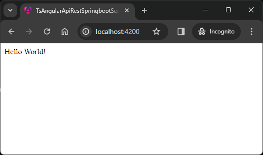

USAGE COMMANDS
--------------

> Please be aware that following tools should be installed on your local PC: **Java**, **Maven**, **NPM**, **Angular CLI** and **Git**. 

> Please **clone/download** project, open **project's main folder** in your favorite **command line tool** and then **proceed with steps below**. 

Usage steps:
1. In a first command line tool start back-end application with `cd .\ts-angular-rest-api-java-springboot-be\ | mvn spring-boot:run`
1. In a second command line tool start front-end application with `cd .\ts-angular-rest-api-java-springboot-fe\ | ng serve`
1. In a browser visit `http://localhost:4200`
1. Clean up environment 
     * In a command line tool stop application with `ctrl + C`

USAGE PICTURES
--------------

DESCRIPTION
-----------

##### Goal
The goal of this project is to present how to connect **front-end** application - basing on **Typescript and Angular** framework - with **back-end** application - basing on **Java and Spring Boot** framework. Connection is done by using **API REST**. 

##### Terminology
Terminology explanation:
* **Java**: object-oriented programming language
* **API REST**: an architectural style for an application program interface (API) that uses HTTP requests to access and use data
* **Spring Boot**: framework for Java. It consists of: Spring + Container + Configuration
* **Maven**: tool for build automation
* **Git**: tool for distributed version control
* **Typescript**: it's superset of Javascript. It means that it contains everything like Javascript plus it's strongly typed, it provides OOPS elements etc. 
* **Angular**: it's component-based framework for building structured single page applications on client side. 

##### Flow
The following flow takes place in this project:
1. User via any browser sends request to front-end application for the content.
1. Front-end application sends request to back-end application for content.
1. Back-end application sends back response with content to front-end application.
1. Front-end application sends back response with content to User via browser.

##### Launch
To launch this application please make sure that the **Preconditions** are met and then follow instructions from **Usage** section.

##### Technologies
This project uses following technologies:
* **Java**: `https://docs.google.com/document/d/119VYxF8JIZIUSk7JjwEPNX1RVjHBGbXHBKuK_1ytJg4/edit?usp=sharing`
* **Maven**: `https://docs.google.com/document/d/1cfIMcqkWlobUfVfTLQp7ixqEcOtoTR8X6OGo3cU4maw/edit?usp=sharing`
* **Git**: `https://docs.google.com/document/d/1Iyxy5DYfsrEZK5fxZJnYy5a1saARxd5LyMEscJKSHn0/edit?usp=sharing`
* **Spring Boot**: `https://docs.google.com/document/d/1mvrJT5clbkr9yTj-AQ7YOXcqr2eHSEw2J8n9BMZIZKY/edit?usp=sharing`
* **Typescript**: `https://docs.google.com/document/d/1uSQvYyzzBnsWEbkcsSoJlK-LfTwHAvh1r2rPP0p2P78/edit?usp=sharing`

PRECONDITIONS
-------------

##### Preconditions - Tools
* Installed **Operating System** (tested on Windows 11)
* Installed **Java** (tested on version 21.0.2)
* Installed **Maven** (tested on version 3.8.5)
* Installed **Git** (tested on version 2.33.0.windows.2)
* Installed **NPM** (tested on version 10.2.4)
* Installed **Angular CLI** (tested on version 17.1.1)

##### Preconditions - Actions
* Download **Source Code** (using Git or in any other way) 
* Open any **Command Line** tool (for instance "Windonw PowerShell" on Windows OS) on downloaded **project's main folder**