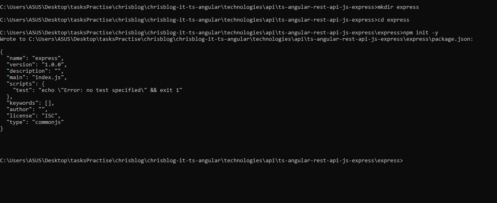
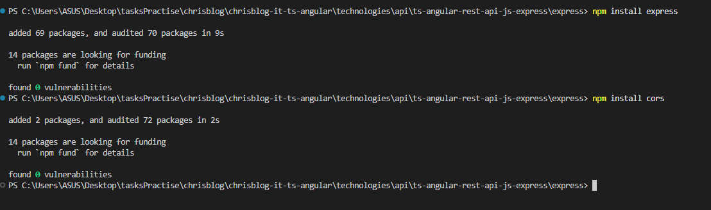
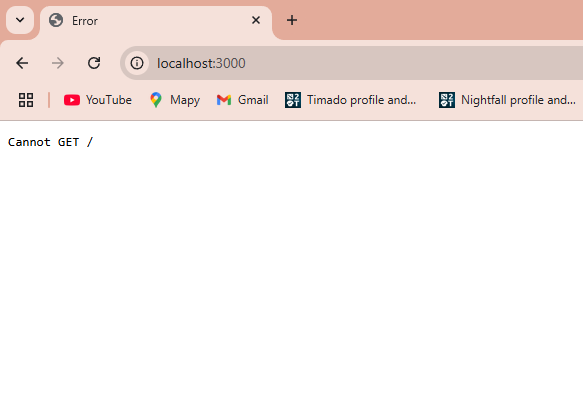
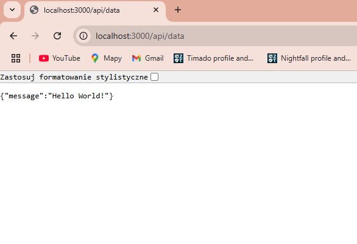
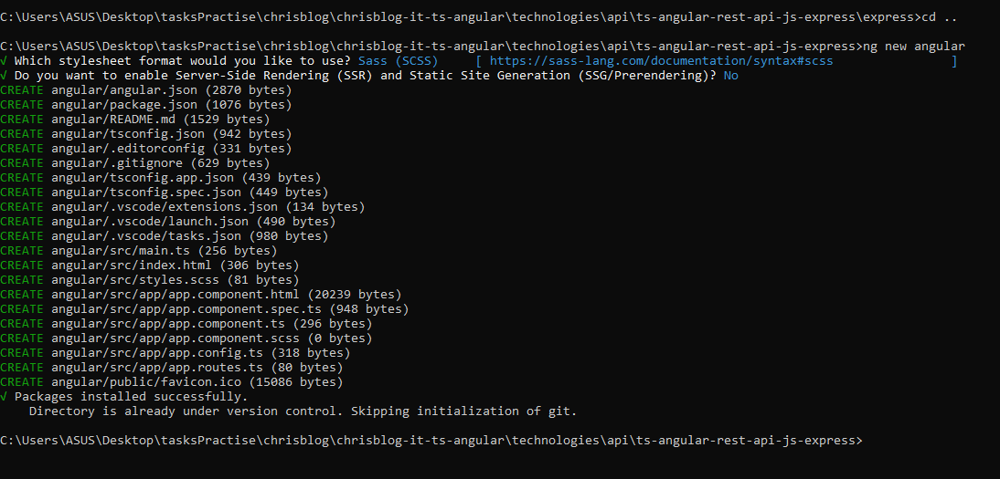
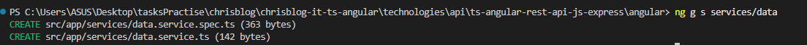
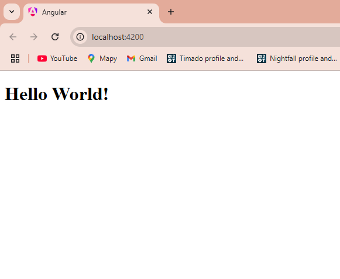

# How to Display "Hello World!" in an Angular Application using Express.js

## Prerequisites

Before starting, make sure you have the following installed:

- **Node.js** ([Download here](https://nodejs.org/)) - Required to run JavaScript server-side and manage packages.
- **Angular CLI** (`npm install -g @angular/cli`) - A command-line interface tool to manage Angular projects.
- **Basic understanding of Angular and Express.js** - Familiarity with TypeScript, Angular components, and HTTP services will help.

---

## Step 1: Set Up an Express.js Server

### 1.1 Create the Backend Directory

Open a terminal and create a new directory for the backend, then navigate into it:

```sh
mkdir express && cd express
```

### 1.2 Initialize a Node.js Project

Run the following command to create a `package.json` file with default settings:

```sh
npm init -y
```

There is how expected result will look like :



### 1.3 Install Required Dependencies

Install `express` (a lightweight web framework) and `cors` (to allow cross-origin requests):

```sh
npm install express
npm install cors
```

Expected output in console : 



### 1.4 Create the Express Server

Create a file named `server.js` and add the following code:

```javascript
const express = require('express');
const cors = require('cors');  

const app = express();
const port = 3000;

// Enable CORS to allow frontend requests
app.use(cors());

const data = {
  message: "Hello World!"
};

// Define an API endpoint that returns data as JSON
app.get('/api/data', (req, res) => {
  res.json(data);
});

// Start the server and listen on port 3000
app.listen(port, () => {
  console.log(`Server is running on http://localhost:${port}`);
});
```

### 1.5 Start the Server

Run the following command to start the Express.js server:

```sh
node server.js
```

You should see output confirming the server is running on `http://localhost:3000` :






---

## Step 2: Set Up the Angular Project

### 2.1 Create a New Angular Project

Open a new terminal and navigate to a workspace where you want the frontend project. Run:

```sh
ng new angular
cd angular
```



---

## Step 3: Configure Angular Application

### 3.1 Create `data.service.ts`

Create a new file `src/app/services/data.service.ts` to handle API requests:



And edit him like this:

```typescript
import { Injectable } from '@angular/core';
import { HttpClient } from '@angular/common/http';
import { Observable } from 'rxjs';

@Injectable({
  providedIn: 'root'
})
export class DataService {
  private apiUrl = 'http://localhost:3000/api/data';  // URL of the Express.js backend

  constructor(private http: HttpClient) { }

  // Method to fetch data from the backend API
  getData(): Observable<any> {
    return this.http.get<any>(this.apiUrl);
  }
}
```

### 3.2 Modify `app.component.ts`

Edit `src/app/app.component.ts` to fetch and display data from the backend:

```typescript
import { Component, OnInit } from '@angular/core';
import { DataService } from './services/data.service';

@Component({
  selector: 'app-root',
  templateUrl: './app.component.html',
  styleUrls: ['./app.component.css'],
})
export class AppComponent implements OnInit {
  data: any;

  constructor(private dataService: DataService) {}

  ngOnInit(): void {
    // Fetch data from the backend when the component initializes
    this.dataService.getData().subscribe(response => {
      this.data = response;
      console.log(this.data); // Log the response to verify the data
    });
  }
}
```

### 3.3 Configure `app.config.ts`

Modify `src/app/app.config.ts` to provide essential Angular services:

```typescript
import { ApplicationConfig, provideZoneChangeDetection } from '@angular/core';
import { provideRouter } from '@angular/router';
import { provideHttpClient } from '@angular/common/http';

import { routes } from './app.routes';

export const appConfig: ApplicationConfig = {
  providers: [
    provideZoneChangeDetection({ eventCoalescing: true }),
    provideRouter(routes),
    provideHttpClient()
  ]
};
```

---

## Step 4: Display the Message

Update `src/app/app.component.html` to display the fetched message:

```html
<h1>{{ data.message }}</h1>
```

---

## Step 5: Run the Angular Application

Start the Angular development server by running:

```sh
ng serve -o
```

This command will:
- **Build** the Angular application.
- **Start** a development server on `http://localhost:4200/`.
- **Open** the application in a web browser automatically.

---

## Step 6: Test the Application

### Expected Behavior

The Angular application should display **"Hello World!"** on the screen.

If everything is set up correctly, you should see:



displayed in the browser, fetched from the Express.js backend.

---
