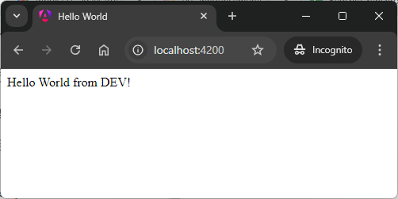

USAGE COMMANDS
--------------

> Please be aware that following tools should be installed in advance on your computer: **node.js** and **angular CLI**. 

> Please **clone/download** project, open **project's main folder** in your favorite **command line tool** and then **proceed with steps below**. 

Usage steps:
1. In a command line tool install nmp packages with `npm install`
1. In a command line tool start application with `ng serve`
1. In a http browser (e.g. Chrome) visit `http://localhost:4200`
   * Expected message **Hello World from DEV!**
1. In a command line tool stop application with `ctrl + C`
1. In a command line tool build application with `ng build --configuration=production`
1. In a command line tool start server with application with `node server.js`
1. In a http browser (e.g. Chrome) visit `http://localhost:8080`
   * Expected message **Hello World from PRD!**
1. Clean up environment 
     * In a command line tool stop application with `ctrl + C`

USAGE IMAGES
------------

DESCRIPTION
-----------

##### Goal
The goal of this project is to present how to use **environment variables** different for **DEV** and **PRD** environmnts in an application type **GUI HTML** in **TypeScript** programming language with usage **angular** framework.

> Please be aware that you have to do changes in **angular.json** file and add property **fileReplacements** for production environment.

##### Terminology
Terminology explanation:
* **TypeScript**: is an extension of JavaScript programming language. Main difference between them is that TypeScript enables defining types for variables - string, boolean, number etc. In this way developer knows type for variables.
* **GUI HTML**: it's an abbreviation for Graphical User Interface. It enables user to interact with application. GUI HTML means that user interacts with application via html web pag.
* **Angular framework**: It’s used for building interactive user interfaces and web applications quickly and efficiently with significantly less code than you would with vanilla JavaScript.
* **Environment variables**: Environment variables are dynamic values that can affect the behavior of running processes on a computer. They are used to store configuration settings, such as file paths, system settings, or user preferences, and can be accessed by software applications to adapt their operations without modifying the code.

##### Launch
To launch this application please make sure that the **Preconditions** are met and then follow instructions from **Usage** section.

PRECONDITIONS
-------------

##### Preconditions - Tools
* Installed **Operating System** (tested on Windows 11)
* Installed **Node** (tested on version 18.18.1)
* Installed **Angular CLI** (tested on version 17.1.0)

##### Preconditions - Actions
* Download **Source Code** (using Git or in any other way) 
* Open any **Command Line** tool (for instance "Windonw PowerShell" on Windows OS) on downloaded **project's main folder**