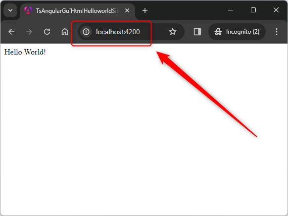

USAGE COMMANDS
--------------

> Please be aware that following tools should be installed in advance on your computer: **node.js** and **angular CLI**. 

> Please **clone/download** project, open **project's main folder** in your favorite **command line tool** and then **proceed with steps below**. 

Usage steps:
1. In a command line tool install nmp packages with `npm install`
1. In a command line tool build application with `ng build --configuration=production`
1. In a command line tool start server with application with `node server.js`
1. In a http browser (e.g. Chrome) visit `http://localhost:8080`
   * Expected message **Hello World!**
1. Clean up environment 
     * In a command line tool stop application with `ctrl + C`

USAGE IMAGES
------------

DESCRIPTION
-----------

##### Goal
The goal of this project is to present how to deploy on **server** type **express** an application type **GUI HTML** in **TypeScript** programming language with usage **angular** framework.

##### Terminology
Terminology explanation:
* **TypeScript**: is an extension of JavaScript programming language. Main difference between them is that TypeScript enables defining types for variables - string, boolean, number etc. In this way developer knows type for variables.
* **GUI HTML**: it's an abbreviation for Graphical User Interface. It enables user to interact with application. GUI HTML means that user interacts with application via html web pag.
* **Angular framework**: It’s used for building interactive user interfaces and web applications quickly and efficiently with significantly less code than you would with vanilla JavaScript.
* **Server**: A "server" is a computer or software that provides services, data, or resources to other computers (clients) over a network.
* **Express**: A server express is a lightweight web application framework for Node.js, often referred to simply as "Express." It is used to build web applications and APIs, providing a robust set of features for web and mobile applications. Express simplifies tasks such as routing, handling HTTP requests, and managing middleware, making it a popular choice for developers building web services or applications with Node.js.

##### Launch
To launch this application please make sure that the **Preconditions** are met and then follow instructions from **Usage** section.

PRECONDITIONS
-------------

##### Preconditions - Tools
* Installed **Operating System** (tested on Windows 11)
* Installed **Node** (tested on version 18.18.1)
* Installed **Angular CLI** (tested on version 17.1.0)

##### Preconditions - Actions
* Download **Source Code** (using Git or in any other way) 
* Open any **Command Line** tool (for instance "Windonw PowerShell" on Windows OS) on downloaded **project's main folder**