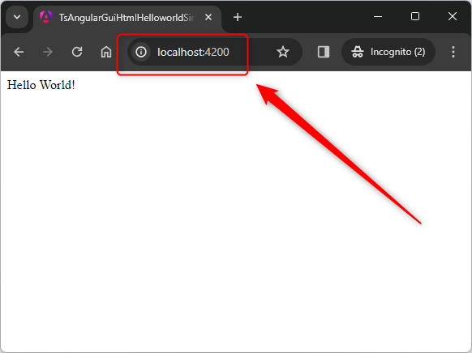

USAGE COMMANDS
--------------

> Please be aware that following tools should be installed in advance on your computer: **node.js** and **angular CLI**. 

> Please **clone/download** project, open **project's main folder** in your favorite **command line tool** and then **proceed with steps below**. 

Usage steps:
1. In a command line tool install globally http server with `npm install -g http-server`
1. In a command line tool install npm packages with `npm install`
1. In a command line tool build application with `ng build --configuration=production`
1. In a command line tool deploy application on server with `http-server dist/ts-angular-gui-html-helloworld-server-httpserver/browser`
1. In a http browser (e.g. Chrome) visit `http://localhost:8080`
   * Expected message **Hello World!**
1. Clean up environment 
     * In a command line tool stop server with application with `ctrl + C`

USAGE IMAGES
------------

DESCRIPTION
-----------

##### Goal
The goal of this project is to present how to deploy on **server** type **http server** an application type **GUI HTML** in **TypeScript** programming language with usage **angular** framework.

##### Terminology
Terminology explanation:
* **TypeScript**: is an extension of JavaScript programming language. Main difference between them is that TypeScript enables defining types for variables - string, boolean, number etc. In this way developer knows type for variables.
* **GUI HTML**: it's an abbreviation for Graphical User Interface. It enables user to interact with application. GUI HTML means that user interacts with application via html web pag.
* **Angular framework**: It’s used for building interactive user interfaces and web applications quickly and efficiently with significantly less code than you would with vanilla JavaScript.
* **Server**: A server is a computer or software system that provides services, data, or resources to other computers, known as clients, over a network. Servers can host websites, manage databases, handle email, and perform other tasks to support multiple clients simultaneously.
* **Http Server**: A JavaScript HTTP server is a server application written in JavaScript that handles HTTP requests and responses. It typically runs on platforms like Node.js, allowing you to create, configure, and manage web servers to serve web pages, APIs, or other resources over the HTTP/HTTPS protocols.

##### Flow
The following flow takes place in this project:
1. User via any html browser sends request to application for the content.
1. Application sends back response to user via html browser with message

##### Launch
To launch this application please make sure that the **Preconditions** are met and then follow instructions from **Usage** section.

##### Technologies
This project uses following technologies:
* **TypeScript**: `https://docs.google.com/document/d/1uSQvYyzzBnsWEbkcsSoJlK-LfTwHAvh1r2rPP0p2P78/edit?usp=drive_link`
* **Node** (section 'Node'): `https://docs.google.com/document/d/1wtk8TTIDLsHSvtyUp7uCk-pOKTpmNwMANRGmBNaoBpc/edit?usp=sharing`
* **Angular framework**: `https://docs.google.com/document/d/1abvo8-fC1QBjzKLh0vX7kZkTKzbo8H0H2N-l6TnIWI4/edit?usp=sharing`

PRECONDITIONS
-------------

##### Preconditions - Tools
* Installed **Operating System** (tested on Windows 11)
* Installed **Node** (tested on version 18.18.1)
* Installed **Angular CLI** (tested on version 17.1.0)

##### Preconditions - Actions
* Download **Source Code** (using Git or in any other way) 
* Open any **Command Line** tool (for instance "Windonw PowerShell" on Windows OS) on downloaded **project's main folder**